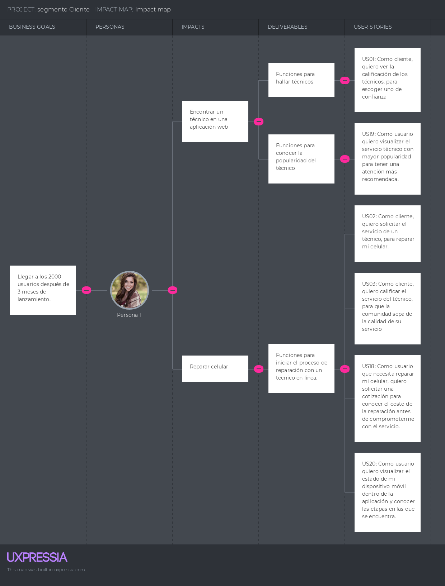
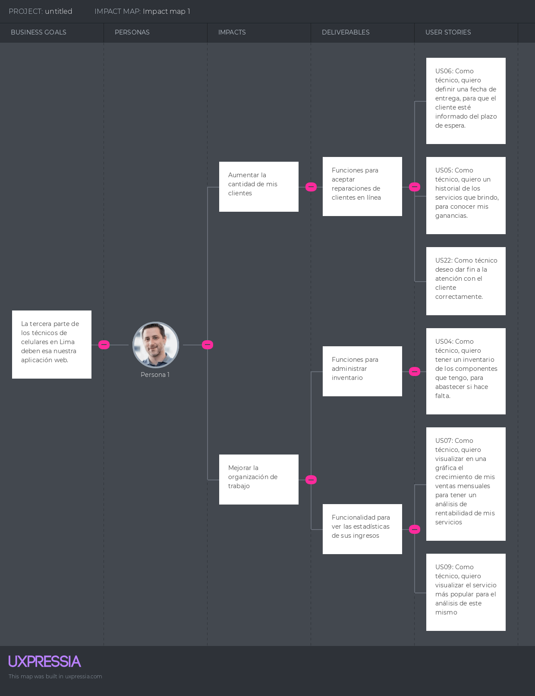

### 3.3. Impact Mapping

El Impact Map nos permite representar la meta, los impactos que queremos lograr en los usuarios, cómo podemos llegar a ese impacto y las historias de usuario que necesitamos para dicho objetivo.

#### User: Cliente que busca reparar su celular

#### User: Técnico que busca aumentar la cantidad de sus clientes y mejorar su sistema de trabajo.

