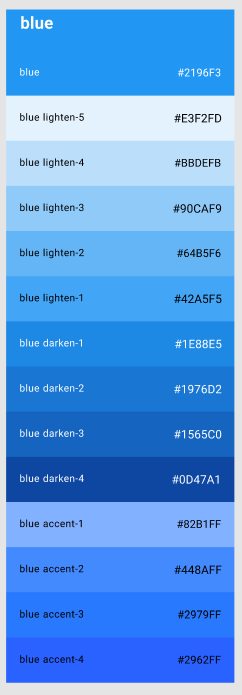
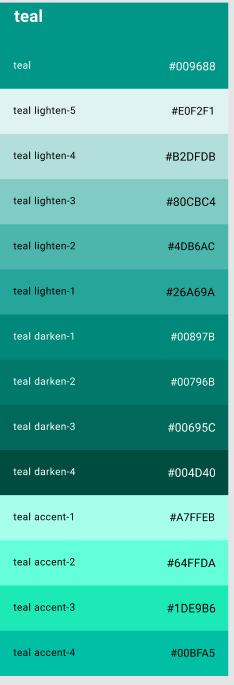
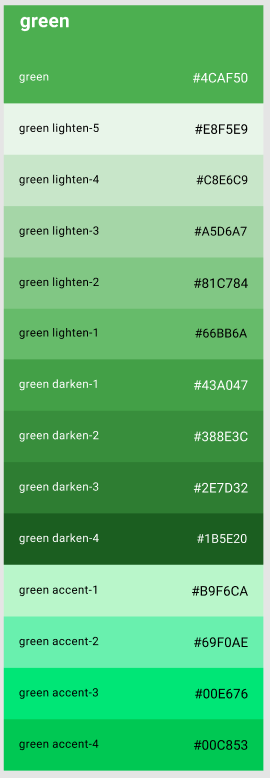
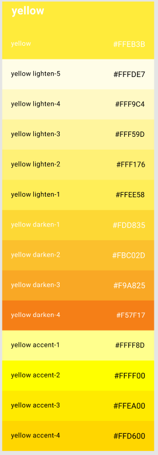
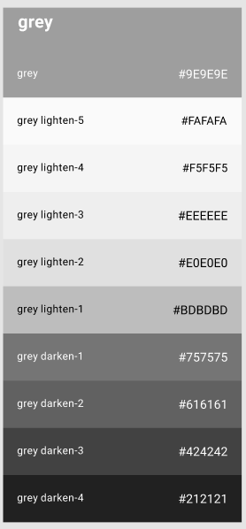

### 4.1.1. General Style Guidelines.

En este apartado, se mostrará de manera organizada los estilos y herramientas que se usarán para diseñar nuestra solución.

**Brand Overview**

La necesidad de contar con un celular en buen funcionamiento se hace más notoria cada día en el Perú, ya sea por estudios, trabajos, etc. El servicio que se le brinda a la persona que desea reparar su celular,  muchas veces no es el adecuado. Es verdad que no todos los técnicos dan un  pésimo servicio, pero los que realmente son buenos, no son conocidos o muy poca gente conoce de ellos, lo que demuestra una desconexión  entre un cliente y un buen técnico por ende ambos segmentos son afectados.

Nuestra solución Techelp, surge a partir de esa desconexión que hay entre los dos segmentos. Nuestro equipo ha diseñado un producto el cual conectará ambos segmentos  para que de esta manera ambos consigan sus objetivos.

**Brand name**

El nombre de nuestra solución es Techelp. Esto debido al notar la necesidad de las personas  por un buen servicio de un técnico de celulares. Del mismo modo, los técnicos son los que brindan ese servicio “Tecnológico”. Por ello, la “tecnología”  en este caso los celulares y el brindar “ayuda” son las piezas claves de este software. Asimismo ambas se juntan ya que queremos dejar claro al usuario que ambas palabras van de la mano. Además, se escogió el inglés  por ser una lengua universal, lo que lo hace más comercial al usuario.

A continuación, se presenta el Logo: 

**Typography**

La tipografía nos ayuda a seccionar por niveles los distintos contenidos de las páginas. Además, atrapa visualmente al usuario si estas son amigables y a su vez lo guía por toda nuestra interfaz.

El tipo de letra que nuestro equipo eligió fue Montserrat debido a su legibilidad al momento de leerlo y escribirlo. La tipografía de Techelp se organiza en 4 niveles headings, body, button y link.

**Colors**

La elección de colores es una parte importante del diseño. Una buena elección de colores transmite al usuario lo que nosotros realmente ofrecemos. Por eso tenemos como color primario el azul y el color secundario el verde azulado. Además, se muestran los colores estado los cuales usaremos para que el usuario sepa qué sucede mientras interactúa con nuestra aplicación.

**Color Primario Azul:**

El color azul siempre hace alucion a dos cosas 	la tecnología y el bienestar. Con ese enfoque, 	damos entender al usuario de que será nuestra 	aplicación web. Además se sabe que el azul	genera serenidad y calma a las personas, 		lo cual queremos lograr con el usuario.

 

**Color secundario azul-verdoso:**

Se eligió por su impacto, su tranquilidad y paz que transmite a los usuarios, pero sobre todo	la confianza. Lo cual es primordial que desea 	mostrar nuestra aplicación.

 

**Color estado: Rojo - (Acción inconclusa	o incorrecta)**

Se usa el rojo para este estado debido 	a que el usuario identificará la acción		que comito de manera errónea 		rápidamente.

 

**Color estado: Verde (Acción exitosa)**

Se consideró el verde como color de	este estado debido a que el usuario			ya se siente familiarizado con este 			color y sabra que la acción fue exitosa		de manera inmediata.

**Color estado: Amarillo (Advertencia de 		una acción)**

Se eligió el color amarillo para este	estado debido a que siempre se ha 	usado para advertir al usuario si está 	cometiendo una acción que afectara 	a futuro las actividades que realice.

**Color Estado: Gris (Botón o Acción deshabilitada)**

Sé usa este color gris par mostrar al usuario que la acción o boton está 	deshabilitada, ya que deberá completar otras posteriormente para poder así 	habilitarlas.

**Spacing**

El espacio que usaremos para cada componente serán múltiplos de 8 pixeles.

**Tono de lenguaje de comunicación y lenguaje aplicado**

El lenguaje que implementaremos será formal ,serio, calma, confiabilidad y entusiasmo. Ya que se desea potenciar la paz, calma y confianza del usuario y darle a entender que la aplicación es serie y podrán solucionar sus problemas con esa aplicación,