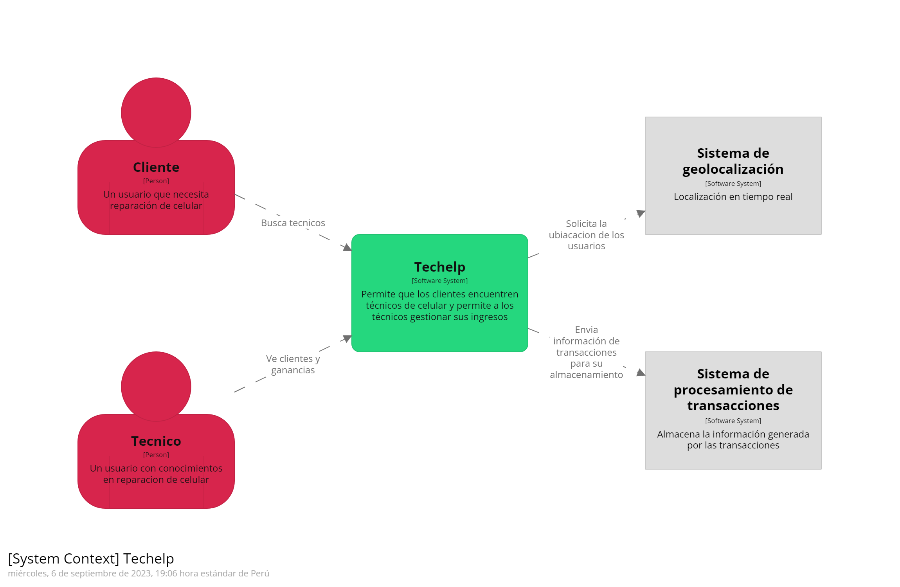

# 4.6 Domain-Driven Software Architecture

### Los diagramas de arquitectura de software nos ayudan a plantear el sistema de nuestro software, basándonos en el enfoque de desarrollo de Domain Driven Design. 
## 4.6.1. Software Architecture Context Diagram.

###  A continuación presentamos el diagrama de contexto de nuestra arquitectura, el cual muestra como encaja en el mundo con los usuarios que lo usa y con los sistemas de software externo que interactúa.

