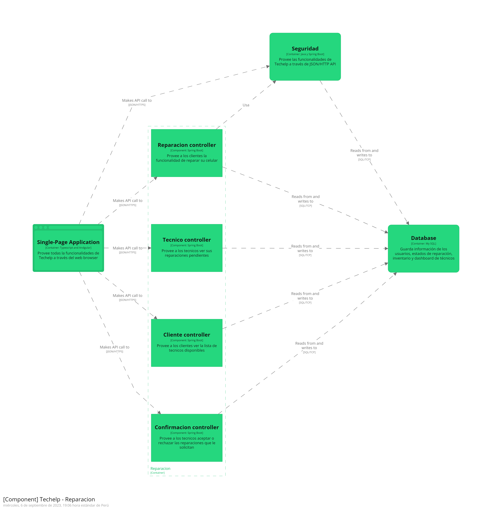
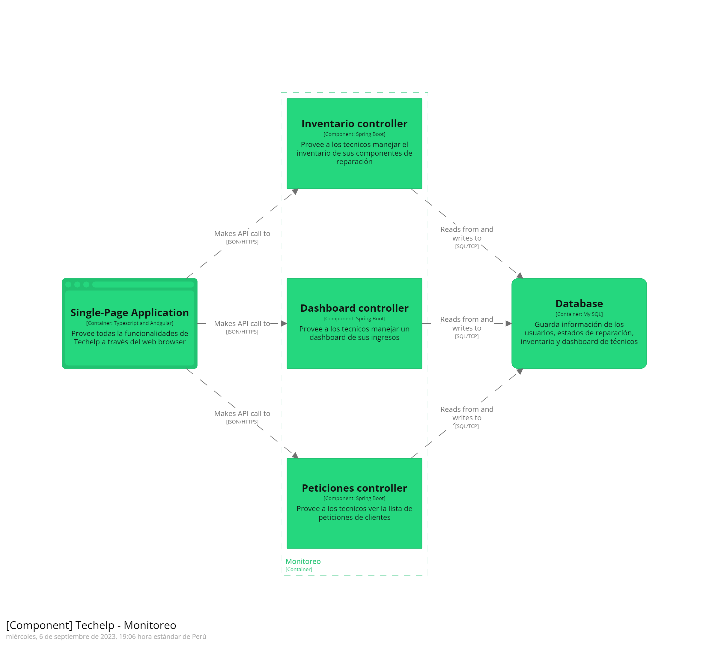
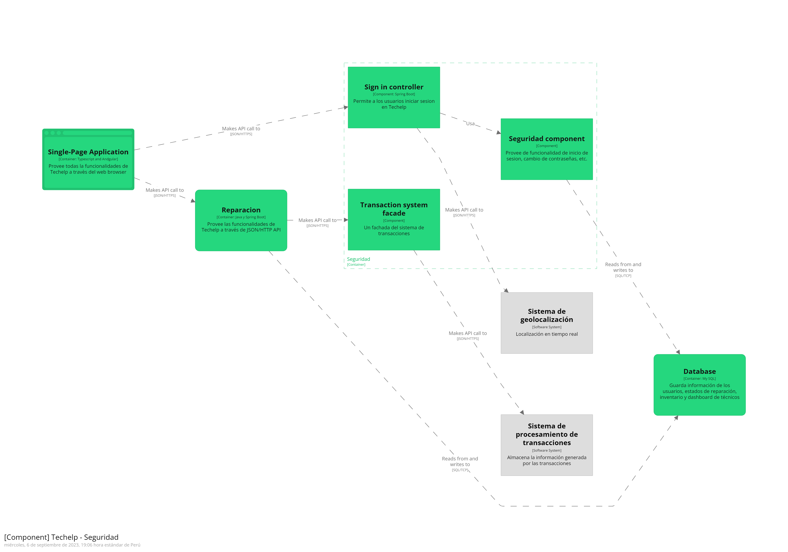
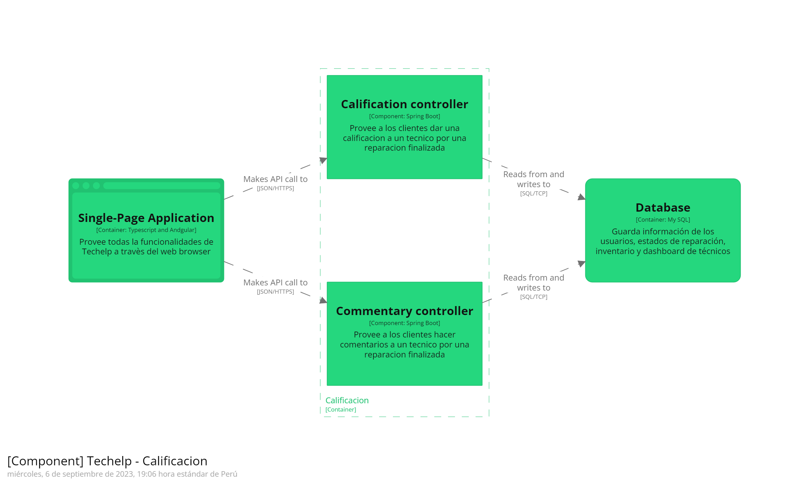

# 4.6.3. Software Architecture Components Diagrams.

### En este apartado se presenta el diagrama de componentes, donde se detallan los componentes que pertencen a cada uno de nuestros contenedores relacionados a los bounded context de nuestro proyecto.

#### Reparación Component Diagram

#### Monitoreo Component Diagram

#### Seguridad Component Diagram

#### Calificación Component Diagram
