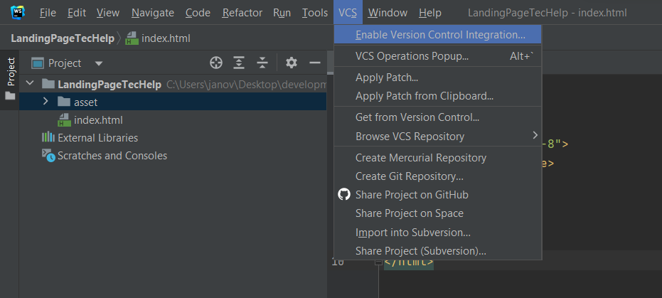
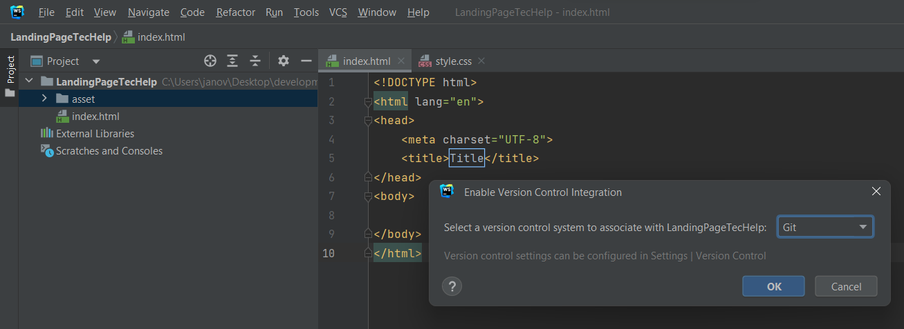
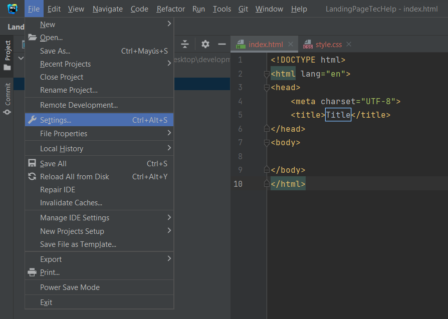
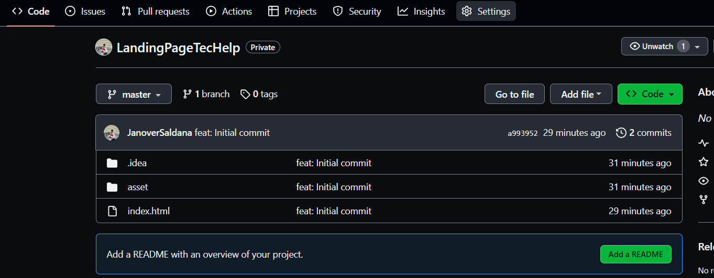
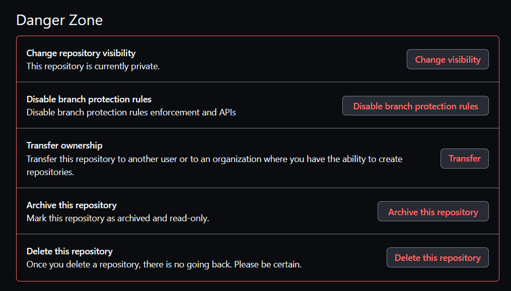
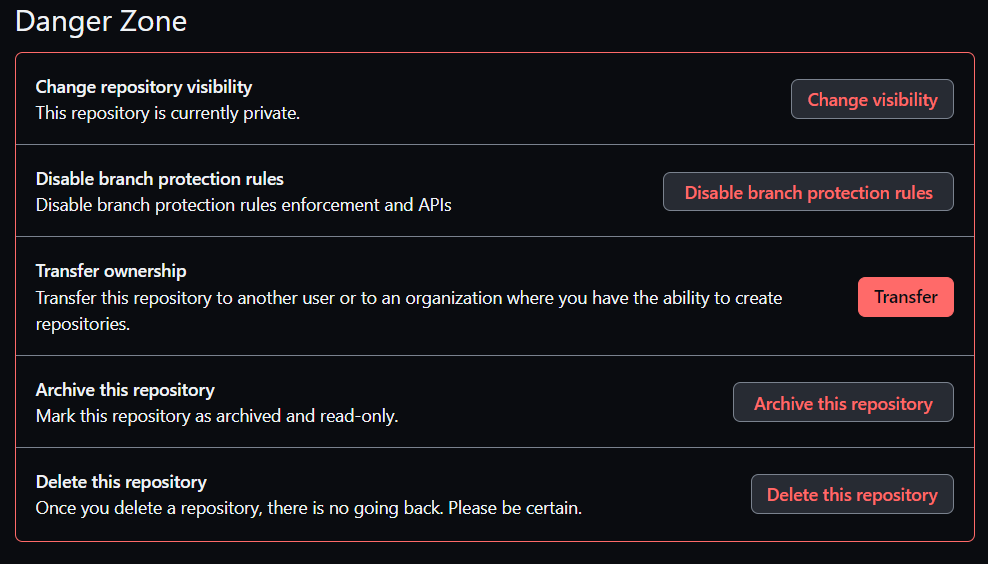
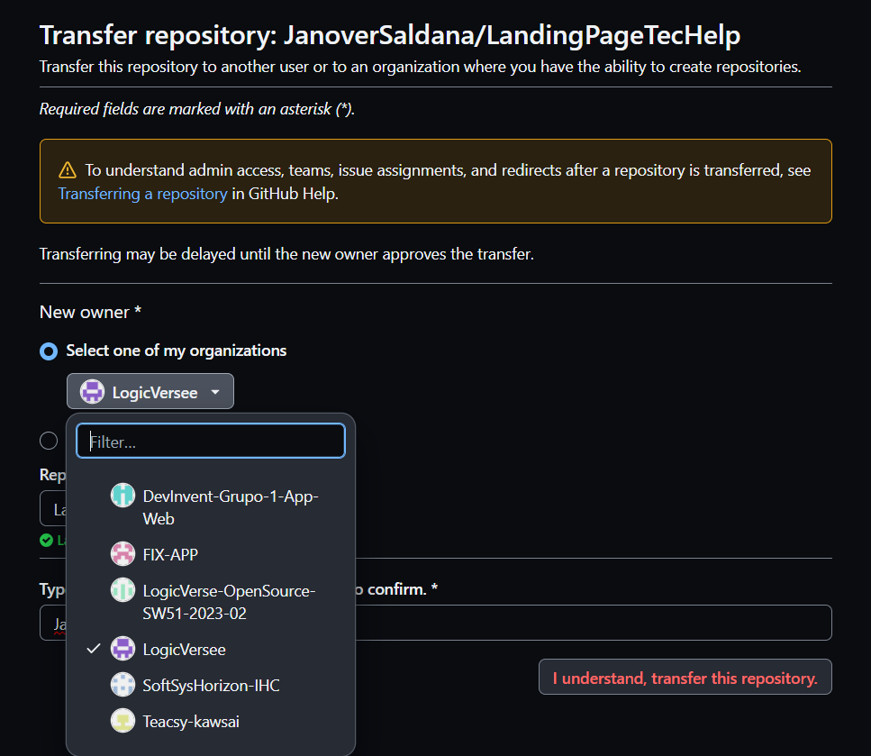
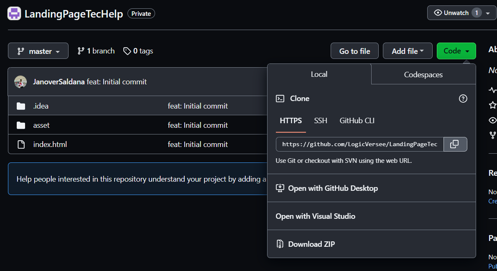
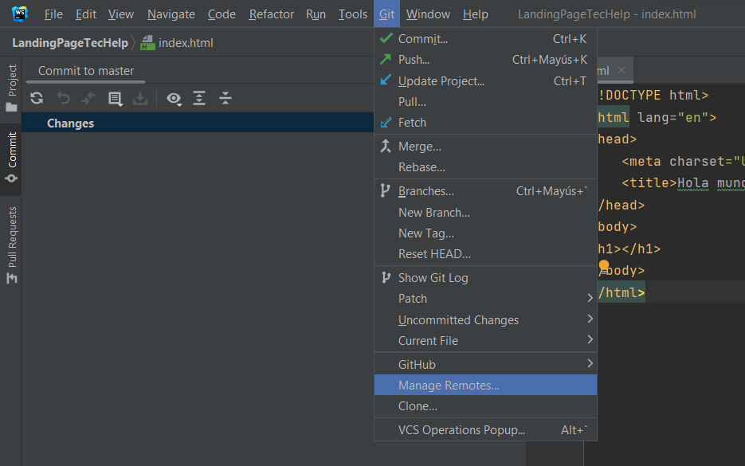
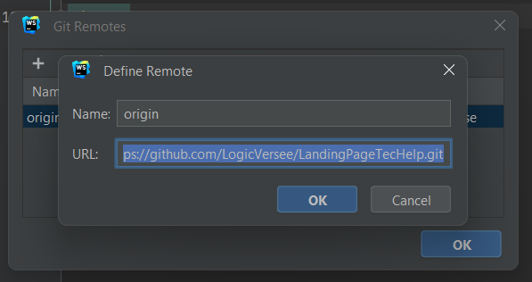

# 5.1.2. Source Code Management

A continuación, se describe la gestión del código fuente, también conocida por sus siglas en inglés como SCM (Source Code Management). Su función principal consiste en rastrear las modificaciones que el equipo llevará a cabo durante el desarrollo de sus proyectos en los repositorios de código fuente. Se utilizará como un sistema de control de versiones que permite seguir los cambios realizados por cada miembro o desarrollador en el proyecto. Además, es importante destacar que utilizaremos **GitHub** como nuestro sistema de control de versiones.

* URL de la organización: [LogicVersee](https://github.com/LogicVersee) - *https://github.com/LogicVersee*
* URL del repositorio de la Landing Page: [Landing Page TecHelp](https://github.com/LogicVersee/TecHelp-LandingPage) - *https://github.com/LogicVersee/TecHelp-LandingPage*
* URL del repositorio del Front-End: [Front-End TecHelp](https://github.com/LogicVersee/TecHelp-FronEnd) - *https://github.com/LogicVersee/TecHelp-FronEnd*
* URL del repositorio del Back-End: [Back-End TecHelp](https://github.com/LogicVersee/TecHelp-Backend) - *https://github.com/LogicVersee/TecHelp-Backend*

## GitFlow

GitFlow es un modelo alternativo para la creación de ramas en Git que se ha convertido en una herramienta esencial para muchos desarrolladores en los últimos años. Este flujo de trabajo de control de versiones, desarrollado y popularizado por Vicent Driessen, desempeña un papel crucial en la gestión de las versiones de un código, facilitando la creación ordenada de nuevas características (Features) y correcciones de problemas urgentes (Hotfixes).

Como se mencionó previamente, GitFlow opera con ramas o "branches". A continuación, se detallan las ramas que se utilizarán en el flujo de trabajo de nuestro proyecto.

* **Main Branches:**
    * **Master:** Esta es la rama principal desde la cual se ramifican todas las demás. Contendrá la versión más reciente junto con las versiones anteriores creadas por los desarrolladores. Aquí se mantendrá el historial oficial de las versiones publicadas.
    * **Develop:** Esta rama puede ser creada a partir de la rama principal (Master) y contendrá todas las características (Features) estables. A través de esta rama, el equipo podrá integrar las funcionalidades de manera efectiva.
* **Support Branches**
A diferencia de las ramas principales, estas ramas secundarias tienen una vida útil limitada, ya que se eliminan al fusionarse con sus ramas primarias.
    * **Feature:**
        * Se ramifica de: develop
        * Debe fusionarse de nuevo en: develop
        * Se utilizan para desarrollar las nuevas funciones que se integrarán en la próxima versión. Es importante destacar que esta rama existe únicamente mientras está en proceso de desarrollo. Sin embargo, una vez que el desarrollador haya completado esa función, se fusionará nuevamente con la rama "develop".
* **Convenciones para nombrar los Features:**
    * **Feture Branch:** feature/name
    **Example:**
        1. feature/welcome
        2. feature/about
        3. feture/myfeture
    * **Conventional Commits**
    El commit debe seguir la siguiente estructura:
    **\<type> [optional scope]: \<description>**
    **[optional body]**
    **[optional footer(s)]**
        * **Type:**
        **1\. feat:** Cuando se agrega un nuevo feature.
        **2\. fix:** cuando corriges un error.
        **3\. build:** cuando afectan los componentes de compilación como la herramienta de compilación, las dependencias o la version del proyecto.
        **4\. chore:** modificaciones privadas del código.
        **5\. docs:** commits que afectan solo a la documentación.
        **6\. refractor:** commits que reescriben o reestructura el código, pero no cambia el comportamiento.
        **7\. perf:** commits especiales que mejoran el rendimiento.
        **8\. style:** commits que no afectan el programa. (espacios en blanco, formato, puntos o comas faltantes).
        **9\. test:** commits que agregan pruebas.
        * **Scope**
        Ofrece información contextual adicional. Aunque es opcional, es beneficioso incluirlo para proporcionar a los desarrolladores una descripción más detallada del commit.
        **\<description>**
        Es una parte obligatoria del formato de los commits. Siempre debemos usar lenguaje en modo imperativo y evitar escribir en mayúsculas
        **[optional body]**
        El cuerpo es opcional y, cuando se utiliza, debe explicar la motivación detrás del cambio y contrastarlo con el comportamiento anterior. Es ideal para mencionar identificadores de problemas y sus relaciones.
        **[optional footer(s)]**
        Esta sección es opcional y puede incluir información sobre cambios significativos. Puede hacer referencia al problema por su identificación y, en esta sección, se incluyen los cambios importantes precedidos por "BREAKING CHANGES:" seguido de uno o dos saltos de línea.
        **Ejemplos:**
            1. feat(welcome): add welcome section
            2. build(release): bump version to 1.0.0
            3. style: remove empty line
            4. feat(sign up): add the button to sign up
            5. feat!: send an email to the costumer when product is shipped
            6. feat: remove ticket list endpoint
            refers to JIRA-1337
            BREAKING CHANGES: ticket enpoints no longer supports list all entites.

Como se mencionó previamente, la gestión de nuestro código fuente se llevará a cabo mediante GitHub. El IDE utilizado en este caso, WebStorm, debe estar vinculado directamente con el repositorio creado por nuestra empresa, MIRAI. De esta manera, cada commit realizado por un miembro del equipo se subirá automáticamente y se cargará en el GitHub de la organización. A continuación, se detallarán las pautas para llevar a cabo este proceso de vinculación de manera correcta:

* **Activar el controlador de versiones del IDE**
Dado que utilizaremos GitHub para gestionar nuestro código, la opción que debe estar habilitada o seleccionada es aquella que indique que el sistema de control se realizará mediante Git. Para hacer esto, siga los siguientes pasos:
    1. Diríjase a la pestaña "VCS" en WebStorm.
    2. Luego, seleccione la opción "Enable Version Control Integration".

Ahora se debe seleccionar el sistema de control a través de Git y, por último aceptar los cambios.

* **Agregar una cuenta de GitHub, siga estos pasos:**
    1. Diríjase a la sección de configuración en su aplicación.
    2. Dentro de la pestaña 'File', busque y seleccione la opción 'Settings'.
    3. En la configuración, busque la sección de cuentas o integraciones.
    4. Agregue su cuenta de GitHub para obtener acceso a los repositorios.

* **Configurar el nombre de usuario de Git**
Una vez que hayas establecido el sistema de control de versiones que se vinculará con tu IDE, deberás ingresar la cuenta que utilizarás. Para hacerlo, sigue estos pasos:
    1. Realiza un commit en tu proyecto. Durante este proceso, se te solicitará que ingreses tu nombre de usuario de Git.
    2. Después de haberlo añadido, todos los cambios se guardarán en el repositorio especificado en esa plataforma, siempre y cuando des la orden correspondiente.
    3. Para configurar tu nombre de usuario de Git, primero selecciona la opción 'commit' que se encuentra dentro de la pestaña 'Git'.

[primer-commit.png](img/primer-commit.png)

* **Guardar el progreso en GitHub**
Con todo configurado en WebStorm, ahora puedes subir tu código a GitHub sin problemas. Simplemente dirígete a la opción 'GitHub' que se encuentra en la pestaña 'Git' y comparte el proyecto.

[compartir-GitHub.png](img/compartir-GitHub.png) 

A continuación, debes ingresar el nombre del repositorio y, si lo deseas, proporcionar una breve descripción. Una vez realizado esto, podrás transferir o copiar el código a un repositorio en GitHub.

[ingresar-nombre-repositorio.png](img/ingresar-nombre-repositorio.png)  

* **Configurar la propiedad del repositorio en GitHub**
Ahora, solo necesitas configurar la ubicación del repositorio. El código ya debería estar guardado en GitHub, pero solo estará presente en tu propia cuenta. Para cambiar la propiedad y transferirla a la organización deseada, sigue estos pasos:
    1. Ingresa al repositorio creado en GitHub.
    2. Selecciona la pestaña 'settings'
    3. Dirigite al apartado de 'DangerZone'
    4. Luego da click en 'transfer'
    5. Finalmente elegimos el nuevo lugar para guardar el repositorio.

* **Configurar control remoto en Git**
Por último, dado que el repositorio ahora está bajo la propiedad de la empresa y depende de ella, es necesario acceder al control remoto del código. Para hacerlo, simplemente ingresa al repositorio creado y copia la URL del repositorio.

Ahora, en el IDE, dirígete a la pestaña 'Git' y elige la opción 'Manage Remotes'.

Finalmente, como último paso, debes pegar el enlace copiado en el campo de dirección que solicita el IDE para el control remoto en Git.

Si has seguido correctamente todos los pasos y directrices mencionados, entonces has completado la configuración con éxito. Ahora, solo necesitas realizar un commit y los cambios que hayas efectuado se guardarán en el repositorio de GitHub, ya sea que hayas realizado modificaciones en el código, creado nuevas ramas u otras acciones.